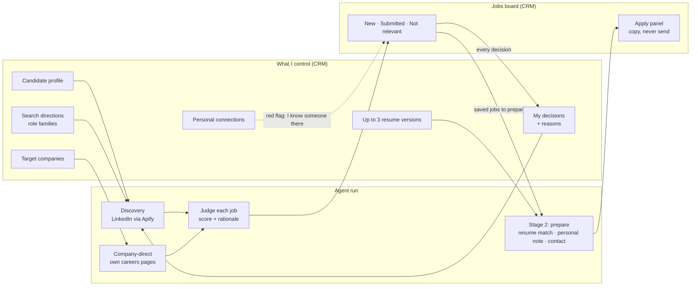

# Job Agent — An Autonomous Job-Search Agent That Learns From My Decisions

> **Portfolio showcase.** This repository presents the design and a few selected pieces of an
> AI agent I built and use for my own job search. It is not the full source code, it is not
> runnable, and it is not licensed for reuse. See [NOTICE.md](NOTICE.md).

The agent reads the job market for me, ranks what fits, prepares the material for the jobs
worth pursuing, and gets sharper every time I record a decision. It is a module of my personal
operating system, [Shalev CRM](https://github.com/shalev123223/shalev-crm-showcase), but lives in
its own repository, joined to the CRM by a written contract.

**Stack:** TypeScript · Anthropic Messages API (Claude) · Model Context Protocol (MCP) ·
Supabase (Postgres + RLS, Edge Functions) · Apify · Zod · Next.js (CRM side) · Vitest

---

## The problem

Job hunting is a full-time job. Hundreds of listings a week arrive, most of them irrelevant, and
the only way to know which is to read them all.

Tools that promise to fix this tend to fail in the same way: they filter on keywords. They throw
away good roles whose titles don't match and flood you with wrong ones that happen to use the
right words. None of them improve, because none of them ever learn what you did with their
suggestions.

### Three failed attempts before this one

This is the fourth generation. The first three failed, and each failure became a requirement:

| Gen | What it was | What went wrong | Requirement it produced |
|---|---|---|---|
| 1 | A workflow-automation pipeline with an LLM step | Deduplicated by *company*, so only one job per company ever survived | Deduplicate by posting, enforced by a unique index |
| 2 | A prompt-driven AI workspace | Its two highest-scored results (85 and 82) were **training bootcamps, not jobs**, and I rated both 1/10 | A bootcamp is not a job. Omit a score you can't justify. Check seniority in the ad text, not the title. |
| 3 | A scheduled AI skill | Four days later it surfaced the *same* bootcamp again, because it had no memory of rejections | **Rejection memory is the core feature**, not an enhancement |

> A fixed keyword list cannot satisfy "don't search by title alone, and surface good titles I
> never wrote down". That requirement is why this is an **agent** and not a query.

## What it does



### Feature map

| Feature | What it does |
|---|---|
| **Search directions** | I describe *kinds of work* (role families, each with its own seniority) instead of keyword lists. The agent is expected to surface titles I never wrote down, as long as the work is the same kind. |
| **LinkedIn discovery** | Searches through a **pinned** Apify actor. The agent picks the search terms; it never picks the scraper or a URL. |
| **Company-direct discovery** | Reads the careers pages of companies I name, which surfaces roles that never reach LinkedIn. The fetcher is locked to that company's own host (see *Security*). |
| **Judgement with reasons** | Each saved job gets an optional 0–100 score and a written rationale. The rationale is kept separate from the employer's verbatim description: argument versus evidence. |
| **Three-lane board** | *New · Submitted · Not relevant*, with single and bulk actions. |
| **Structured rejection reasons** | `too_senior`, `role_mismatch`, `location_mismatch`, `industry_mismatch`, `salary_mismatch`, `already_applied`, `other`, plus a free note. |
| **Feedback loop** | Every run reads my decision history before searching. Rejected jobs never come back, and the reasons shape what it looks for next. |
| **Stage 2: preparation** | For saved jobs that haven't been prepared yet, the agent matches the right resume version and scores the match, writes a **personal note** on why the job is worth my time, and records a **named contact** if the posting names one. |
| **Apply panel** | Shows the prepared material with copy buttons, next to my **standing answers** (salary expectation, notice period, …), which are quoted exactly as I wrote them and never generated. The panel renders and copies; **it never sends**. |
| **Cover letters** | The panel displays Hebrew letters right-to-left and English letters left-to-right. Drafting in the agent is being rolled out. |
| **Personal connections** | I keep a list of people I know and where they work. A job at one of those companies gets a **red flag** on its card. |
| **Stale-listing cleanup** | Selects undecided jobs older than 14, 30, 60 or 90 days. I preview, then confirm, and the result is a soft delete. Clearing a stale listing is *not* recorded as a rejection. |
| **Run observability** | Every run records status, stop reason, turns, jobs saved, searches and estimated cost. |
| **Cost ceiling** | Spend is checked *before* each model request, not after. |

## How I thought about it

### 1. The agent can read my decisions, but it can never write them

This one restriction is what makes the feedback loop trustworthy. **An agent that can edit the
record it learns from isn't learning; it's drifting.**

- There is no tool that writes to `job_feedback`, and the feedback table itself is append-only.
- `save_jobs` is **insert-only**. It can't update or delete anything, and it can't set a job's
  status.
- The one stage-2 write, `enrich_job`, can reach **exactly one JSON key**. Its input schema is
  `.strict()`, so a `status` field in the input is a validation error rather than a field that
  gets silently ignored.
- The same rule applies to facts about me: the agent may argue that a job fits, but my salary
  expectation is quoted, never invented.

→ [`tools/index.ts`](excerpts/agent/tools/index.ts) ·
[`enrich-job.ts`](excerpts/agent/tools/enrich-job.ts) ·
[decision](docs/decisions/001-agent-cannot-write-decisions.md)

### 2. The agent sends a verdict, not a job

The first real run showed that the model was paraphrasing job descriptions on the way back. The
column meant to hold the employer's words held a summary instead. The fix inverted the flow: the
agent sends only an ID, a score, a rationale and a direction, and the **server** writes the title,
URL and full description from what the search actually fetched. Verbatim is now guaranteed by the
code, not by an instruction to the model. As a side effect, a run no longer carries 80 full ads
back and forth through the conversation, which is what had pushed a $1.50 run to $2.02.

→ [`save-jobs.ts`](excerpts/agent/tools/save-jobs.ts) ·
[decision](docs/decisions/002-verdict-not-job.md)

### 3. Three kinds of "company intent", deliberately kept apart

| Table | Kind | Meaning | Effect on the bar |
|---|---|---|---|
| `job_search_directions` | semantic | "this *kind* of work, wherever it is" | — |
| `job_target_companies` | literal | "read *this* employer's careers page" | **does not** lower the bar |
| `job_company_connections` | social | "I know someone here" | **does** lower the bar |

Merging any two of these would erase the distinction they exist to preserve.

Connections also have two sources:
- **personal:** people I actually know.
- **referrer list:** a much larger community sheet of volunteers I've never met.

Only *personal* connections count. The community list covers almost the whole market, so if it
counted too, "lower the bar" would become the default for almost every job and the red flag would
stop meaning anything.

**Contact phone numbers and emails are never sent to the model.** The agent never contacts
anyone, so it has no use for a way to reach them.

→ [migration](excerpts/database/create_job_company_connections.sql) ·
[decision](docs/decisions/003-three-kinds-of-company-intent.md)

### 4. The red flag is never the model's opinion

The connection badge on a job card is **recomputed from the connections table every time the page
renders**. It never reads anything the agent wrote. This has three consequences:

- A connection the model imagines cannot produce a badge.
- A connection I add today lights up jobs saved months ago, with no re-run.
- A contact who leaves is removed once, and every card updates.

Matching works on whole words ("NVIDIA" matches "NVIDIA ISRAEL R&D LTD", but "Meta" doesn't match
"Metaphor Labs"). For the cases that still miss, there are aliases I edit by hand. They are never
inferred, because a matcher that guesses gets it wrong silently.

→ [`company-connections-matcher.ts`](excerpts/crm/company-connections-matcher.ts)

### 5. Feedback has two axes, and system facts are neither

The old tracking sheet mixed three different things into one "Decision" column: what I did
(*Selected*), why I did it (*Too senior*), and facts about the posting (*Duplicate*, *Closed*).
Merging them corrupts the learning signal: "the user rejected 40 jobs" is wrong when 30 of them
were stale listings I never judged. Now:

- `decision` has exactly two values;
- `reason` is optional and can only accompany a rejection. The database makes any other
  combination impossible to store;
- system facts stay out of the feedback table entirely.

Because timestamps are transaction-scoped in Postgres, "latest row wins" needed a monotonic `seq`
column to be a total order. A dry run caught this before production did.

→ [migration](excerpts/database/create_job_feedback.sql) ·
[decision](docs/decisions/004-two-axis-feedback.md)

### 6. Cost is a correctness property

The first budget check ran *after* each model turn. A live run breached its $1.50 ceiling and
finished at $2.02, because the expensive request had already been paid for. Now the check runs
**before** every request, using a deliberately high token estimate (mixed Hebrew/English job ads
tokenize poorly) and list prices rather than promotional ones. A cap that stops slightly early is
the right direction to be wrong in.

→ [`budget.ts`](excerpts/agent/run/budget.ts)

### 7. A long-running agent on a 150-second platform

The loop runs as a Supabase Edge Function, and a single call is capped at 150 seconds. A real run
(several searches of up to a minute each, plus model turns) doesn't fit. Instead of splitting the
run into a fixed sequence of steps, which would turn the agent back into a workflow, the run is
**bounded, resumable chunks of one conversation**:

- the message history is saved between chunks, so the model truly continues where it stopped;
- a chunk *yields* (which is not terminal) when its time budget runs low, checked before starting
  anything that could overrun;
- a lease stops two runs of the same mode from overlapping and doubling the scraping spend;
- the CRM keeps requesting the next chunk until the run is done. Closing the tab only pauses the
  run.

→ [decision](docs/decisions/005-resumable-chunks.md)

### 8. What it deliberately does *not* use

**No RAG, on purpose.** The context the agent reasons over is small and precise: one profile, a
handful of directions, up to three resumes and my decision history. The tools load it in full, so
nothing is lost to retrieval ranking, and every piece of evidence the agent used can be traced.
Postgres full-text search (`tsvector`) powers the CRM's search box. Embeddings would add
approximation where exact data is available.

Also deliberately absent: SQL access, arbitrary HTTP, choosing the scraper, and **any ability to
send** an email, an application or a form.

## Security

- **SSRF-hardened fetcher.** The model never supplies a host. It passes a company ID and a path,
  and the origin comes from a host column that **Postgres generates**. Every request and every
  redirect hop is re-checked for scheme, exact host, private, loopback, link-local and CGNAT
  addresses (including IPv4-mapped IPv6), cloud-metadata names and DNS resolution. Responses are
  capped in size and time.
  → [`company-site.excerpt.ts`](excerpts/agent/connectors/company-site.excerpt.ts)
- **Scraped text is data, never instructions.** The test fixtures include a prompt injection on
  purpose.
- **No service-role key.** The agent works under a real user session, so row-level security
  applies to every write.
- **Separate credentials** for the tool server and the run trigger, so each has a smaller blast
  radius.
- **"Never sends" is tested structurally.** Tests assert that the Apply panel contains no form,
  no input and no submit button.
  → [`ApplyPanel.test.excerpt.tsx`](excerpts/crm/ApplyPanel.test.excerpt.tsx)

## Engineering practice

- **29 architecture decision records** in the agent repo, including the ones that reversed
  earlier choices (a managed-agent runtime replaced by Edge Functions, for example).
- **~250 Vitest cases** in the agent (tools, connectors, loop, budget, hard stops, validation)
  and **~120** on the CRM side of the Jobs module.
- **Three interchangeable runtimes** over one tool layer: the production Edge Function, a local
  runner, and a model-free CLI driven from a coding-agent session, which costs a fraction of a
  full run.
- **A byte-identical contract file in both repositories** records who owns every table and every
  field.

## Repository map

```
docs/
  architecture.md          components, runtimes, a run end to end
  decisions/               selected architecture decision records
excerpts/
  agent/tools/             tool surface, insert-only save, one-key enrichment
  agent/run/               pre-flight budget
  agent/connectors/        SSRF-pinned careers-page fetcher
  crm/                     connection matcher, "never sends" tests
  database/                feedback and connections tables
```

## What is intentionally not here

The full agent and CRM code, the system prompt, the complete schema, my profile and resumes, the
companies I applied to, my contacts, and all credentials.

---

Built by **Shalev Menachem** · [Portfolio](https://shalevpro.shalevmenahem.com/)
