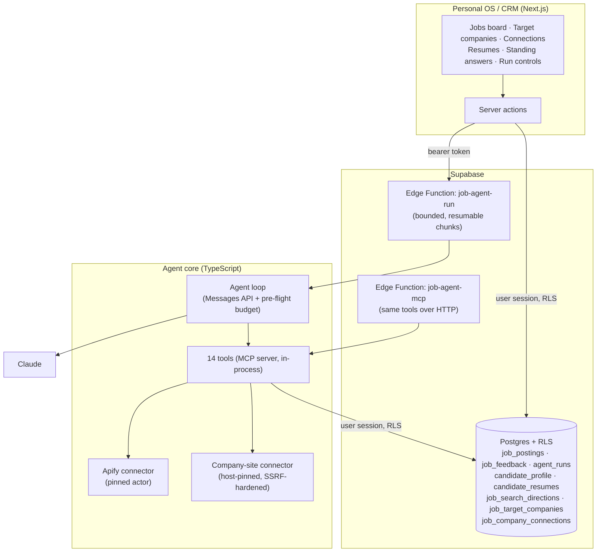

# Architecture

## Components

## The tool surface

The list of registered tools is where the rules are enforced: anything that isn't registered
cannot be reached.

| Tool | Kind | Notes |
|---|---|---|
| `get_candidate_profile` | read | Hard stop if empty: the agent won't search for a profile that doesn't exist |
| `get_search_directions` | read | Enabled role families only; hard stop if there are none |
| `get_recent_searches` | read | Avoids repeating yesterday's searches |
| `get_feedback_history` | read | Latest decision per job, with reason and note |
| `search_jobs` | fetch | Pinned Apify actor; capped per run; results cached on the run, and the model sees excerpts only |
| `get_target_companies` | read | Companies I named |
| `fetch_company_page` / `fetch_company_jobs` | fetch | Takes a company ID and a path, never a URL; the host is pinned |
| `check_jobs_exist` | read | Deduplicates before any judgement is spent |
| `save_jobs` | insert | A verdict only; the server writes the facts; insert-only |
| `get_resumes` | read | Enabled slots only |
| `list_jobs` | read | Saved jobs for stage 2, optionally only those not yet enriched |
| `enrich_job` | update | Exactly one JSON key; `.strict()` input |
| `record_run_event` | insert | Notes for the run record |

**Deliberately absent:** SQL, schema access, arbitrary HTTP, choosing the scraper, any write
path to decisions, and any ability to send anything.

## A discovery run, end to end

1. I press **Find jobs** in the CRM. A server action calls the run function with its own bearer
   token.
2. The **runner**, not the agent, opens an `agent_runs` row and takes a lease for that mode.
3. The agent reads the profile, directions, feedback history and recent searches, and stops if a
   hard precondition fails.
4. It decides which searches to run (spread across roughly four directions per run) and calls
   `search_jobs`. Full postings are cached on the run; the model sees excerpts.
5. `check_jobs_exist` removes anything already known, including jobs I cleared or rejected.
6. For each remaining job, the agent checks seniority in the ad text, rejects bootcamps, and
   weighs my past decisions as *evidence, not rules*.
7. `save_jobs` sends only verdicts. The server inserts the verbatim postings with status `new`.
8. Before every model request, the budget is checked. When a chunk's time runs low, it
   **yields**: the conversation is saved and the CRM requests the next chunk.
9. The runner closes the run with a stop reason and cost, and removes the heavy scratch data.

## Stage 2, end to end

1. I press **Enrich saved jobs**. The run works through saved jobs that haven't been prepared yet. Letting me pick specific jobs is being rolled out.
2. The same agent receives a different objective: it doesn't hand off to a second agent.
3. It reads the resume versions (up to three, sent whole) and the jobs to prepare.
4. For each job it records a matched resume (the label is checked against the live labels), a
   match score, a personal note and, if the posting names one, a contact.
5. The CRM's Apply panel shows all of this next to my standing answers, with copy buttons. I do
   the applying.

## Runtimes

| Runtime | Purpose |
|---|---|
| Supabase Edge Function | Production; bounded, resumable chunks |
| Local runner | Development; the same `executeRun` function |
| Model-free tool CLI | Drives the same tools from a coding-agent session, at a fraction of the cost |

Because all three share the tool layer and the run function, changing the host is a runtime swap,
not a rewrite.

## Two repositories, one contract

The agent and the CRM share a **database schema**, not code. A contract file, kept byte-identical
in both repositories, records who owns what:

| Thing | Owner |
|---|---|
| Writing `job_postings` | agent (insert only) |
| `job_postings.status` transitions | CRM (the agent sets only the initial `new`) |
| Writing `job_feedback` | CRM (my decisions only) |
| Writing `agent_runs` | agent runner |
| Resumes, directions, target companies, connections | edited in the CRM, read by the agent |
| Standing answers | CRM; the agent may quote them, never generate them |
| `careers_host` | Postgres (a generated column; neither repository writes it) |
